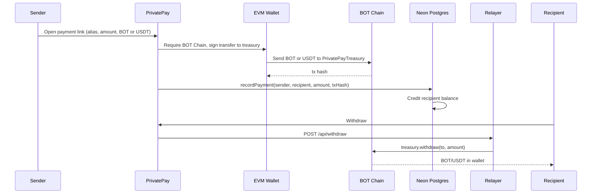
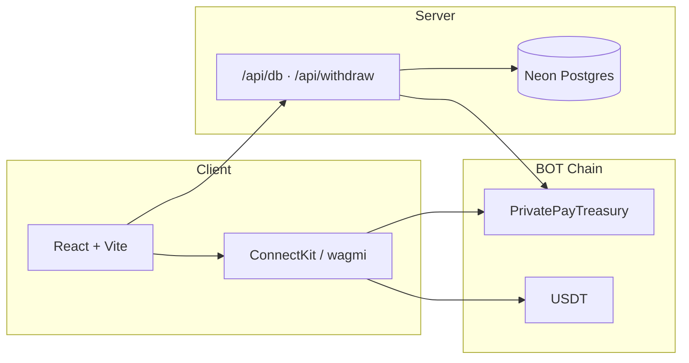

# PrivatePay on BOT Chain

Untraceable private payments on **BOT Chain** only. Stealth payment links, a shared treasury, and a relayer-backed withdraw path — no Base, ENS, or BitGo.

| | Link |
|---|------|
| **Pitch deck** | [Private-Pay — Botchain (Google Slides)](https://docs.google.com/presentation/d/1-m43OKlqB9R0MvISJZj7Ngs4UpEafBMJJkeybu08bxg/edit?usp=sharing) |
| **GitHub** | [AmaanSayyad/Privatepay-B](https://github.com/AmaanSayyad/Privatepay-B) |
| **Live app** | [https://privatepay-production.up.railway.app/](https://privatepay-production.up.railway.app/) |
| **Treasury (mainnet, chain 677)** | [`0x706b24fD623074d055963E77398E6112396490b2`](https://scan.botchain.ai/address/0x706b24fD623074d055963E77398E6112396490b2) |
| **Treasury (testnet, chain 968)** | [`0xfad9a3c0522bC933d6E284C446E75Dc9B45Bb079`](https://scan.bohr.life/address/0xfad9a3c0522bC933d6E284C446E75Dc9B45Bb079) |
| **Demo video** | [https://youtu.be/aiZc_6dlNeU](https://youtu.be/aiZc_6dlNeU) |

---

## What it does

Share one static link (e.g. `amaan.privatepay.bot`). Each payment sends **BOT** or **USDT** on BOT Chain to the treasury. The recipient’s in-app balance is credited, then they withdraw to their own wallet. Observers see transfers to a shared contract, not a durable sender↔receiver pair.

- **Sender privacy** — the payee’s personal wallet is not the on-chain destination
- **Receiver privacy** — funds land in treasury, then leave via the relayer
- **Simple UX** — one payment link, unlimited incoming payments
- **BOT Chain only** — wallets are forced onto chain 677 (or 968 in testnet mode)

---

## Networks

Canonical config lives in [`src/botchain.js`](src/botchain.js). Switch with `VITE_BOTCHAIN_NETWORK=mainnet` or `testnet`.

| | Mainnet | Testnet |
|---|---|---|
| **Name** | BOT Chain | BOT Chain Testnet |
| **Chain ID** | `677` | `968` |
| **RPC** | `https://rpc.botchain.ai` | `https://rpc.bohr.life` |
| **Explorer** | [scan.botchain.ai](https://scan.botchain.ai) | [scan.bohr.life](https://scan.bohr.life) |
| **Native token** | BOT (18 decimals) | BOT (18 decimals) |
| **USDT** | [`0xabab…7a3c`](https://scan.botchain.ai/token/0xababc7ddc03e501d190c676bf3d92ef0e6e87a3c) (6 decimals) | [`0x75ed…0fe3`](https://scan.bohr.life/token/0x75edC9335175Fc0552D51D48439F229c10420fe3) (6 decimals) |
| **Treasury** | see `deployments/botchain-677.json` | see `deployments/botchain-968.json` |

Hardhat networks: `botchain` and `botchainTestnet` in [`hardhat.config.cjs`](hardhat.config.cjs).

---

## Payment flow



Settlement is always on BOT Chain. Balances and payment links live in Neon (reached only through `POST /api/db`).

---

## Stack



| Piece | Role |
|---|---|
| **BOT Chain** | Only settlement network. Native BOT + USDT. |
| **PrivatePayTreasury** | Holds deposits; relayer/owner withdraws. Also registers meta-addresses, stealth slots, and a DarkPool-style commitment pool. |
| **Neon Postgres** | Users, payment links, balances, payments, points. No browser database client. |
| **ConnectKit / wagmi** | Wallet connect; auto-switch to BOT Chain. |
| **Vercel or Railway** | Host the SPA plus `/api/db` and `/api/withdraw`. Railway uses [`server.mjs`](server.mjs). |

---

## Getting started

### Prerequisites

- Node.js ≥ 20
- An EVM wallet funded with BOT (and USDT if you want token payments)
- A Neon project ([console.neon.tech](https://console.neon.tech))

### Install

```bash
npm install
cp .env.example .env
```

### Environment

| Variable | Description |
|---|---|
| `DATABASE_URL` | Neon pooled connection string |
| `DIRECT_URL` | Neon direct URL (migrations only) |
| `VITE_BOTCHAIN_NETWORK` | `mainnet` (default) or `testnet` |
| `VITE_SHARED_TREASURY_ADDRESS` | Deployed `PrivatePayTreasury` |
| `VITE_BASE_TREASURY_ADDRESS` | Same address (legacy env name) |
| `DEPLOYER_PRIVATE_KEY` | Funded BOT Chain key for `npm run contract:deploy` |
| `RELAYER_ADDRESS` | Address allowed to call `withdraw` (defaults to deployer) |
| `TREASURY_PRIVATE_KEY` | Relayer key for `/api/withdraw` — **server only, never commit** |
| `VITE_BACKEND_URL` | Optional. Point the SPA at a separate API (e.g. `http://localhost:3400`) |

Optional RPC/USDT overrides: `VITE_BOTCHAIN_CHAIN_ID`, `VITE_BOTCHAIN_RPC_URL`, `VITE_BOTCHAIN_EXPLORER`, `VITE_BOTCHAIN_USDT_ADDRESS`. Defaults are in `src/botchain.js`.

### Run

```bash
npm run dev          # Vite — http://localhost:5173
npm run dev:all      # Vite + backend together
npm run db:check     # Confirm Neon is reachable
```

`/api/db` and `/api/withdraw` are not served by Vite. Use `vercel dev`, `npm run dev:all`, or set `VITE_BACKEND_URL`. Production on Railway: `npm run build && npm start`.

---

## Contracts

[`contracts/PrivatePayTreasury.sol`](contracts/PrivatePayTreasury.sol) — treasury, meta-address registry, stealth deposits, DarkPool commitments.

```bash
npm run contract:compile
BOTCHAIN_NETWORK=testnet npm run contract:deploy   # chain 968
BOTCHAIN_NETWORK=mainnet npm run contract:deploy   # chain 677
```

Writes `deployments/botchain-<chainId>.json`. Copy `privatePayTreasury` into `VITE_SHARED_TREASURY_ADDRESS`.

```bash
BOTCHAIN_NETWORK=testnet npm run contract:e2e
BOTCHAIN_NETWORK=testnet npm run contract:e2e:usdt
```

| Function | Who | What |
|---|---|---|
| `receive()` | Anyone | Accept native BOT |
| `withdraw(to, amount)` | Relayer / owner | Pay out BOT |
| `setMetaAddress` / `getMetaAddress` | Relayer / anyone | BIP 0352–style meta address |
| `depositToStealth` / `withdrawStealth` | Anyone / relayer | Stealth slot by `(recipientId, ephemeralPub)` |
| `depositToPool` / `withdrawFromPoolWithApproval` | Anyone | Commitment pool + relayer-signed nullifier |

---

## Project structure

```text
src/
  botchain.js            # Chain id, RPC, explorer, USDT
  config.js              # Treasury, display chains, payment-link suffix
  pages/
    IndexPage.jsx        # Dashboard
    SendPage.jsx         # Send & withdraw on BOT Chain
    BasePage.jsx         # BOT Chain hub
    PaymentPage.jsx      # Pay via /payment/:alias
    PaymentLinksPage.jsx
    TransactionsPage.jsx
  lib/supabase.js        # Neon client (name kept; calls POST /api/db)
  providers/ConnectKitProvider.jsx   # wagmi, BOT Chain only
  hooks/useAppWallet.js  # Connect + force-switch to BOT Chain

api/
  db.js                  # Neon action allow-list
  withdraw.js            # Relayer withdraw

contracts/PrivatePayTreasury.sol
scripts/deploy-treasury.cjs
deployments/botchain-677.json
deployments/botchain-968.json
server.mjs               # Railway: SPA + /api/*
```

---

## Testing

```bash
npm run test
```
